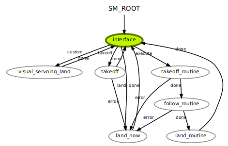

# State Machine

The system follows an state machine defined in [sm.py](src/sm.py). 

- The visual servoing state is still under development, it moves the camera down, tries to locate the landing pad(using a reference image located at `$HOME/catkin_ws/src/cv_detection/imgs/rectangle/cropped/landingpad.png`)

For the available states please refer to [sm_states.py](src/sm_states.py)


</br>
</br>


# drone control

Is performed using a PID controler for each of the dof `x,y,z,yaw`. The weights of the controller can be modified by running the interface node with the aditional parametter `calibrate:=true`.

```
mon launch indoor_drone interface.launch map_name:=demo99 calibrate:=true
```


e.g. the P parameter of the x axis = P_x * 10^(mult_P_x)

# customize the interface GUI

In a new terminal run the command `designer` and open the file `$HOME/catkin_ws/src/rqt_interface/resources/MyPlugin.ui` to edit the interface GUI.

The interface's backend is located in `$HOME/catkin_ws/src/rqt_interface/src/rqt_interface/module.py`

# State estimation

The system uses the ORB_slam3 algorithm to map the environment end localize it self in it. I case the SLAM fails to localize the drone. The system will use the internal odometry of the drone and run open loop, starting from the last known SLAM position.


# Visualize camera image in a new window

terminal 4: ```rosrun image_view image_view image:=/bebop/image_raw```