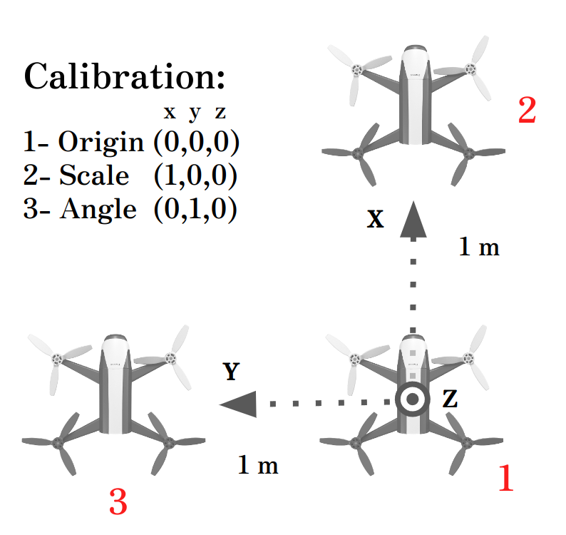
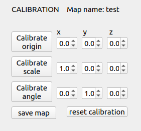

# Indoor Drone

Demo to control a bebop 2 drone in indoor environments.

Tested on Ubuntu 20.04 with ROS Noetic

## dependencies
- [ROS](http://wiki.ros.org/noetic/Installation/Ubuntu)
- [ORB SLAM 3](https://github.com/UZ-SLAMLab/ORB_SLAM3.git)

```
sudo apt install ros-${ROS_DISTRO}-rosmon
```

## setup
```
cd ~
mkdir catkin_ws/src -p
cd catkin_ws/src

#clone repo
cd catkin_ws

rosdep init
rosdep update
rosdep install --from-paths src

catkin build
```

add the following line to the end of the `~/.bashrc` file:
```
export LD_LIBRARY_PATH=$LD_LIBRARY_PATH:$HOME/catkin_ws/devel/lib/parrot_arsdk
source $HOME/catkin_ws/devel/setup.bash
```
reopen the terminal or run `source ~/.bashrc`

> :exclamation: **SAFETY BUTTONS setup** :exclamation: \
This is a safety measure to allow the operator to land or kill the drone at any point using system level keyboard shortcuts\
 \
open the ubunut settings:  settings -> Keyboard Shortcuts -> (scroll down) "+" \
add the following shortcuts: \
1 - name: `land_drone`, commnad: `touch /home/<your user>/catkin_ws/land_bebop.txt` , shortcut: `<you define> e.g. alt+1`\
2 - name: `hover_drone`, commnad: `touch /home/<your user>/catkin_ws/hover_bebop.txt` , shortcut: `<you define> e.g. alt+2`\
3 - name: `kill_drone`, commnad: `touch /home/<your user>/catkin_ws/kill_bebop.txt` , shortcut: `<you define> e.g. alt+3`\
The Kill_button node will keep track of these files and land or kill the drone if needed

---
---
# Interface and environment setup

## Scan the environment (creating a new map)
Connect with the drone

- terminal 1: ```roscore```
- terminal 2: ```mon launch indoor_drone interface.launch map_name:=demo99```

launches the GUI for the inteface. The parameter "map_name" will define the desired SLAM map name to be saved.

Make sure that the drone image is being shown in the bottom left of the interface ("raw image")

Now launch the SLAM node without any map_name argument. It will generate a new map from scratch.
- terminal 3: ```roslaunch odom_slam_sensor_fusion orb_slam3_bebop2.launch ```


- Move the drone slowly around the environent.

You will notice that the "tracking image" will now show a bunch of green dots (features). This features are tracked and compared between multiple images and are used to infer camera's position.

>**Tips for good scans**\
Begin and end the scaning process from the same point in the space, ideally the origin or place where the drone will takeoff.\
Make sure that the camera is not too close to objects.\
Try to always keep features in frame.\
If the scan looks weird after calibration (blobs of features in the wrong places or missing features), restart the scanning process.





## Calibrate the coordinate frame
This is step is necessary to compute the transformation between the slam map to the desired real world frame.

1) place the drone in the desired origin of the map facing the desired x axis, and press **"callibrate origin"**
2) move the drone 1 metter to the front (positive x), and press **"callibrate scale"**
3) move the drone 1 metter to the left (positive y), and press **"callibrate angle"**

Note: it is possible to use other calibration points by changing the coordinates next to the calibraition buttons.

The new calibrations will be automatically saved after each step.



## Save the scanned map

After calibration, a pointcloud of features will appear in the interface. These features are already in the desired coordinate frame, defined durring calibration.

Attent that a few features in the pointcloud will be shown in green. These features are the ones currently in the frame of the camera and corespond to the green dots shown in "tracked image".

Make sure that the features pointcloud correspond with the real world objects. If not, you can try to recalibrate or restart the scanning process.

- Once you are satisfied with the scaning and calibration. Press **"save map"**


## generate trajectories

Once the drone is connected, the SLAM algorithm is running, and the map is calibrated, you can generate custom trajectories. To do that, manualy move the drone to the desired position and press "add current wp". The recorded waypoints will be shown in the rviz interface and as a list under "waypoints".

It is possible to edit and delete each waypoint by selecting it in the list and pressing the corresponding button (`edit`,`del`).

Another option is to load trajectory from a list of coordinates. To do so, use the button **"from file"**. This will open a new window where you can locate the json file containing the sequence of coordinates. The coordinates should be in the following format: `x,y,z,yaw`. An example of a valid input is:
```
// moves the drone in a square with side 1m
{"wps":[[0,0,1,0],[1,0,1,0],[1,1,1,0],[0,1,1,0],[0,0,1,0]]}
```


---

# Running the demo

## Launch the demo interface (reusing an existing map)

connect to the bebop wifi and then:

(open terminal windows with: crtl + alt + t)

- terminal 1: ```roscore```
- terminal 2: ```mon launch indoor_drone interface.launch map_name:=demo99``` launches the GUI for the inteface

TODO: interface image
- terminal 3: ```roslaunch odom_slam_sensor_fusion orb_slam3_bebop2.launch map_name:=demo99``` launches the SLAM node reusing the previously recorded map "demo99"


---

## Execute a trajectory

All the items in the "status" list should be green before fliying.

Make sure that the location of the drone is correct in the map and it is responsive when manualy moving the vehicle. If not, restart the SLAM node.

Once the drone is ready, press "execute" and the drone will takeoff and start following the selected trajectory. The drone will land automatically after the last waypoint.


----

### Relevant links

[System details](DETAILS.md)
